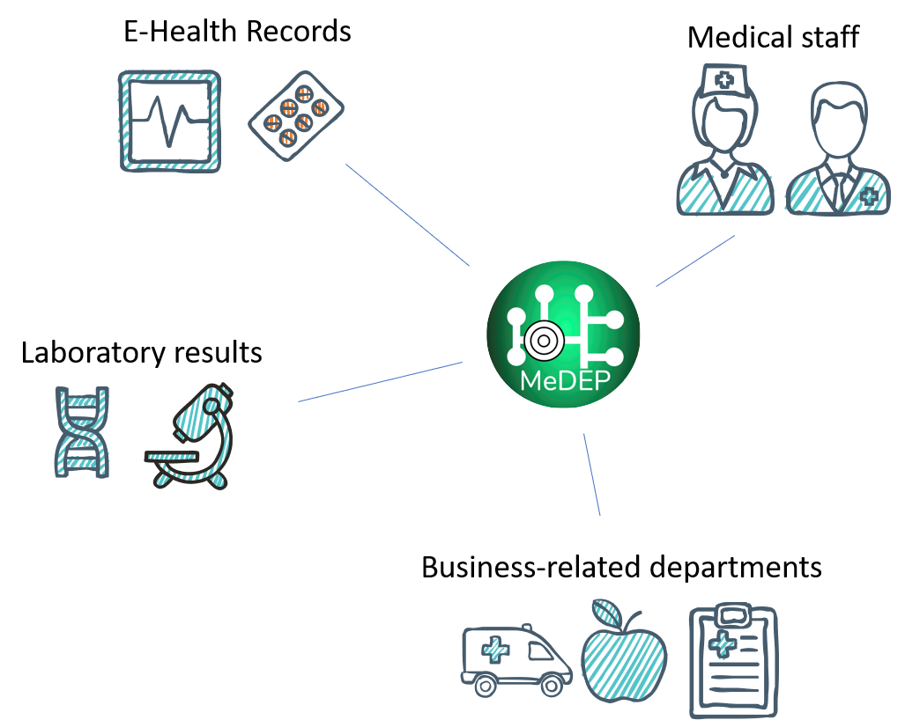

<h1>MeDEP - Medical Data Exploitation Platform</h1>

[MeDEP](https://medep.org) can help you in various cases.

**Are you a medical doctor that needs to efficiently browse a fast growing body of literature, regarding COVID-19? Are you interested only in particular aspects of the disease?**

By using AI, more than 30 000 biomedical documents have been automatically annotated with key-words, and our [keyword explorer](https://medep.org/keyword-explorer) is ready for rank the documents according to your searches.

**Are you a part of hospital management staff? Do you want your analysts to work on outdated data? Probably not.**
Let MeDEP take care of data moving, cleaning, anonymization, access control, audit trails, versioning, etc. and let the analysts use their time to actually analyze the data, and provide you with up-to-date reports and KPIs. 

**Are you a data scientist who is wasting time on data sourcing and wrangling, rather than building models and doing research?**
Advocate MeDEP platform within your organisation to get access to readily available preprocessed, versioned, up-to-date and approved data sets. Your fast pace will make colleagues think you are a rock star.

## MeDEP
Healthcare IT ecosystems are incredibly complex, developed and maintained by many vendors and often poorly integrated. This results in technical difficulties and data integrity issues on a daily basis. It is becoming increasingly difficult to obtain quality data.
MeDEP solves issues related to data acquisition and comes in two flawors: MeDEP local and MeDEP federated. Choose your weapon!

 <div class="row">
  <div class="column">
    
  </div>
  <div class="column">
    
  </div>
</div>

## Info Dashboard

[Info Dashboard](https://medep.org/info-dashboard) joins many data sources and efficiently presents the relevant information related to the covid-19 pandemic, for a given country:

- number of currently infected people
- stock exchange sentiment
- clinical protocols
- data related to the drugs used
- legislation changes in the country, e.g., declaration of quarantine
- news

The stock exchange sentiment is computed from the main stock exchange index of the chosen country and reflects the trend the current trend of stock prices, as compared to their global trend.

## Case studies

[Webpage]() and the folder [`./frontend/public/case_studies`](frontend/public/case_studies) includes examples (in the form of ipython notebooks) of how various methods could be used for knowledge prioritization and potential learning across hospitals:

1. **COVID-19 vaccine-related literature exploration** (Topic modeling of COVID-19 vaccine-related literature)
2. **Document landscape exploration** (Interactive 2D representations of more than 30k COVID-19 related papers) 
3. **Distributed modeling of clinical outcomes** (Deep learning and streaming models were used to explore possible modeling opportunities related to COVID-19 outcome, while preserving privacy of the data.)
4. **Assessing potential COVID-19 drug candidates via automated literature exploration** (Discovering novel drug candidates by using the MeDEP's convenient API and text mining functionality.)

# Get up and running

```
docker-compose up -d --build
```

Go to http://localhost:8080/ for MeDEP application. Data access portal of University Medical Centre Maribor is serving data on: http://localhost:8090/data

